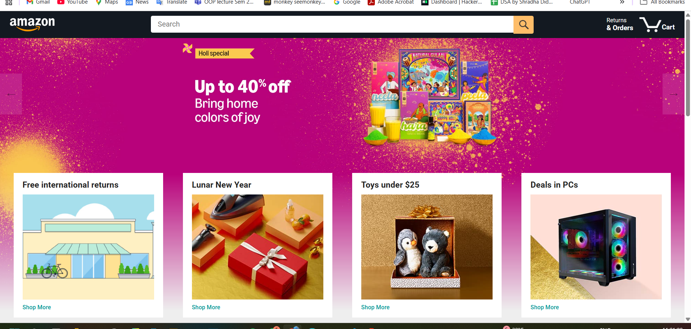

🛒 Amazon Clone (Frontend)

A responsive Amazon Clone built using HTML, CSS, and JavaScript, replicating the core UI and functionality of the Amazon website. This project focuses on frontend design, layout structure, and dynamic user interaction using pure JavaScript.

🚀 Features

🧭 Responsive Navbar & Menus – Interactive header with search bar, categories, and user section

🛍️ Product Listing Page – Displays products dynamically with images, names, and prices

❤️ Add to Cart Functionality – Items can be added or removed from the cart using JavaScript

💸 Cart Summary – Calculates total amount dynamically

📱 Fully Responsive – Works seamlessly on desktop, tablet, and mobile

🎨 Modern UI Design – Clean layout inspired by Amazon’s interface

🛠️ Tech Stack

HTML5 – Page structure and layout

CSS3 – Styling, animations, and responsiveness

JavaScript (ES6) – Dynamic interactions and cart logic

📂 Project Structure
amazon-clone/
│
├── index.html           # Homepage
├── products.html        # Product listing page
├── cart.html            # Cart and checkout page
├── styles/
│   └── style.css        # Main stylesheet
├── scripts/
│   └── main.js          # JavaScript logic for UI and cart
└── assets/
    └── images/          # Product and UI images

💡 How to Run

Clone this repository:

git clone https://github.com/yourusername/amazon-clone-frontend.git

Open the folder in your code editor.

Run index.html in your browser to start exploring the project.

📸 Preview

### 🏠 Homepage

